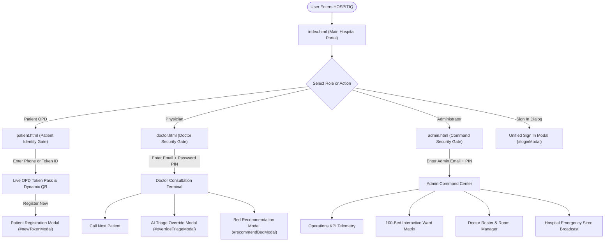
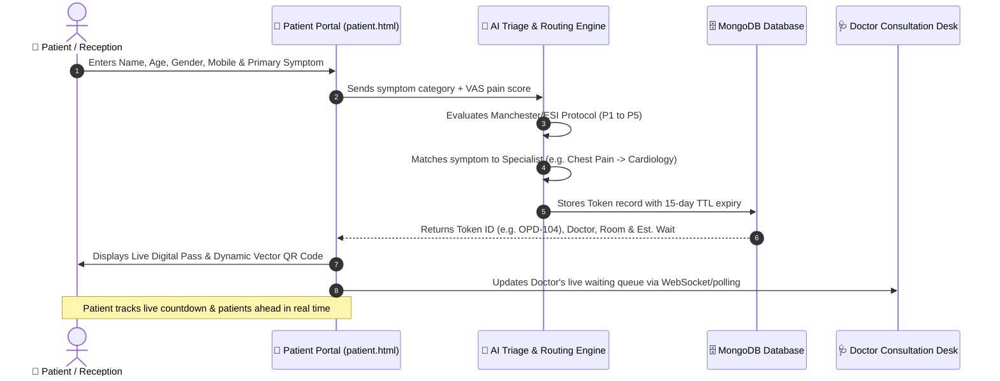
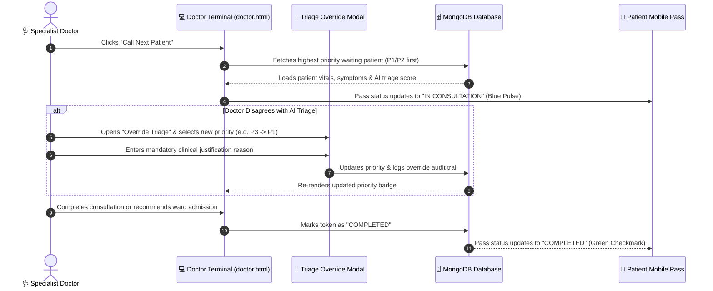
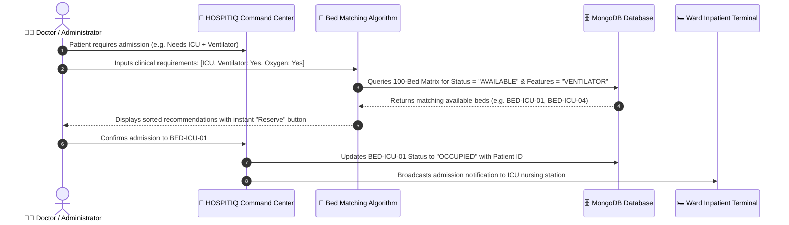
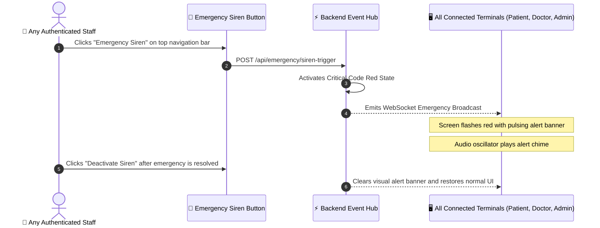
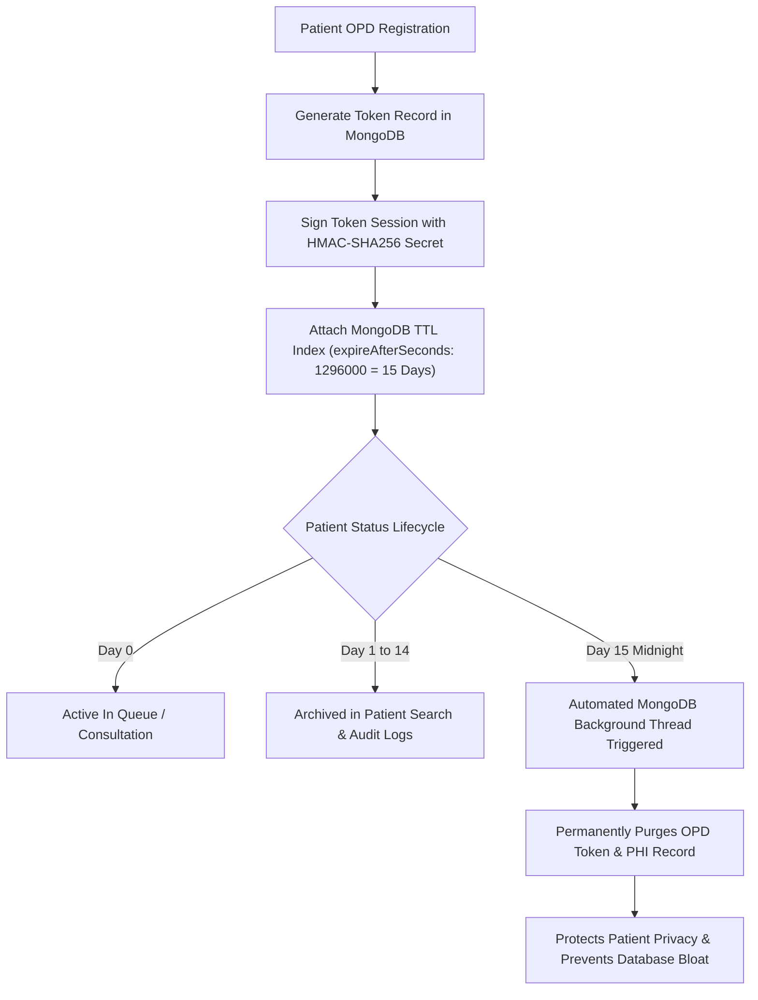

# HOSPITIQ — Master UI Element Catalog, Menu Reference & Architecture Flow Diagrams
**Project**: MTX B2B Healthcare Innovation Project  
**System**: HOSPITIQ Next-Generation Smart Hospital Platform (Enterprise v2.4)  
**Scope**: Exhaustive UI Element Directory, Menu Hierarchies, Input Specs & Complete Mermaid Flow Diagrams

---

## 📑 Table of Contents
1. [Global Architecture & Navigation Flowchart](#1-global-architecture--navigation-flowchart)
2. [Portal 1: Main Landing & Unified Hub (`index.html`)](#2-portal-1-main-landing--unified-hub-indexhtml)
3. [Portal 2: Patient OPD Portal & Live Pass (`patient.html`)](#3-portal-2-patient-opd-portal--live-pass-patienthtml)
4. [Portal 3: Doctor Consultation Terminal (`doctor.html`)](#4-portal-3-doctor-consultation-terminal-doctorhtml)
5. [Portal 4: Hospital Admin Command Center (`admin.html`)](#5-portal-4-hospital-admin-command-center-adminhtml)
6. [Complete System Flow Diagrams](#6-complete-system-flow-diagrams)
   - [Flow A: Patient OPD Journey & AI Triage Routing](#flow-a-patient-opd-journey--ai-triage-routing)
   - [Flow B: Doctor Consultation & Clinical Override Flow](#flow-b-doctor-consultation--clinical-override-flow)
   - [Flow C: 100-Bed Inpatient Allocation & Ward Management](#flow-c-100-bed-inpatient-allocation--ward-management)
   - [Flow D: Emergency Siren Hospital-Wide Broadcast Flow](#flow-d-emergency-siren-hospital-wide-broadcast-flow)
   - [Flow E: Security Cryptography & 15-Day Data Lifecycle](#flow-e-security-cryptography--15-day-data-lifecycle)

---

# 1. Global Architecture & Navigation Flowchart



---

# 2. Portal 1: Main Landing & Unified Hub (`index.html`)

The main entry point for the hospital facility, showcasing public telemetry, hero metrics, role launchpads, and quick token generation.

```
┌─────────────────────────────────────────────────────────────────────────────────────────────────────────┐
│ [Logo HOSPITIQ]   [Branch: Central Hospital]        [Global Search...]    [🚨 Siren] [10:42 AM] [☀️/🌙] │
├─────────────────────────────────────────────────────────────────────────────────────────────────────────┤
│                                                                                                         │
│      Next-Generation Smart Hospital OPD Triage & Inpatient Operations Orchestration                     │
│      [⚡ Register OPD Token]    [📱 Track My Token]    [🩺 Doctor Desk]    [🛡️ Admin Console]          │
│                                                                                                         │
│  ┌────────────────────────┐  ┌────────────────────────┐  ┌────────────────────────┐                    │
│  │ 🧑‍⚕️ PATIENT OPD PORTAL  │  │ 🩺 DOCTOR CONSULTATION │  │ 🏢 ADMIN COMMAND CENTER│                    │
│  │ Live queue countdown,  │  │ Live patient queue, AI │  │ 100-bed ward matrix,   │                    │
│  │ room # & vector QR pass│  │ triage overrides & beds│  │ doctor roster & KPIs   │                    │
│  │ [Launch Patient Pass →]│  │ [Launch Doctor Desk →] │  │ [Launch Command Room →]│                    │
│  └────────────────────────┘  └────────────────────────┘  └────────────────────────┘                    │
│                                                                                                         │
│  ┌─ LIVE OPD QUEUE METRICS ──────────────────────────────────────────────────────────────────────────┐ │
│  │ Total Registered: 128  │ Waiting: 14  │ Served Today: 114 │ Avg Wait: 12 Mins │ Emergency Bays: 02 │ │
│  └────────────────────────────────────────────────────────────────────────────────────────────────────┘ │
└─────────────────────────────────────────────────────────────────────────────────────────────────────────┘
```

### UI Elements & Menus in `index.html`:

| Element / Menu Name | Element Type | HTML ID / Selector | Purpose & Action |
|---|---|---|---|
| **HOSPITIQ Brand Logo** | Brand Link | `.brand` | Returns to the home view / refreshes status. |
| **Hospital Branch Selector** | Location Badge | `.hospital-branch-selector` | Displays active hospital branch ("HOSPITIQ Central Hospital"). |
| **Global Search Input** | Search Field | `#globalSearchInput` | Search patients, tokens, doctors, or bed IDs across hospital. |
| **Emergency Siren Button** | Glow Action Button | `#triggerEmergencyModeBtn` | Activates high-visibility red flashing emergency siren mode. |
| **Live Clock** | Real-time Widget | `#liveTimeClock` | Shows synchronized hospital local time (e.g. `10:42 AM`). |
| **Theme Toggle Button** | Icon Button | `#themeToggleBtn` | Switches seamlessly between Dark Navy Mode and Light Mode. |
| **"Register OPD Token" Button**| Action Button | `#heroRegisterBtn` | Opens the Patient Registration & AI Triage Modal (`#newTokenModal`). |
| **"Track My Token" Button** | Action Button | `#heroTrackBtn` | Navigates directly to `patient.html` token lookup view. |
| **"Launch Doctor Desk" Button**| Action Button | `#heroDoctorBtn` | Navigates to `doctor.html` physician consultation desk. |
| **"Admin Console" Button** | Action Button | `#heroAdminBtn` | Navigates to `admin.html` hospital command center. |
| **Patient Dedicated Card** | Hero Launch Card | `.dedicated-portal-card.cyan-glow` | Direct 1-click launch to Patient OPD Portal. |
| **Doctor Dedicated Card** | Hero Launch Card | `.dedicated-portal-card.blue-glow` | Direct 1-click launch to Doctor Consultation Terminal. |
| **Admin Dedicated Card** | Hero Launch Card | `.dedicated-portal-card.purple-glow`| Direct 1-click launch to Admin Command Center. |
| **Unified Sign In Modal** | Glass Modal Dialog | `#loginModal` | Central modal allowing role selection and password entry. |

---

# 3. Portal 2: Patient OPD Portal & Live Pass (`patient.html`)

Designed for patients waiting on mobile devices or in hospital bays with live queue telemetry and zero login friction.

```
┌─────────────────────────────────────────────────────────────────────────────────────────────────────────┐
│ SIDEBAR                  │ PATIENT OPD PASS DASHBOARD                                                  │
│ [HOSPITIQ Logo]          │                                                                             │
│ ──────────────────────── │  ┌─ PATIENT IDENTITY GATE (When not logged in) ───────────────────────────┐ │
│ 🎫 My OPD Token Pass     │  │ Enter Mobile Number or Token ID: [ 9900011223          ] [Verify Pass] │ │
│ ➕ Book New Token        │  │ Demo Tokens: [🔴 OPD-101 (Cardiology)] [🟠 OPD-102] [🟡 OPD-103]        │ │
│ 🏠 Main Hospital Portal  │  └────────────────────────────────────────────────────────────────────────┘ │
│ 🩺 Doctor Portal         │                                                                             │
│ 🛡️ Admin Command         │  ┌─ ACTIVE OPD PASS CARD (When verified) ─────────────────────────────────┐ │
│                          │  │  TOKEN NUMBER: OPD-104       STATUS: WAITING (In Queue)                │ │
│ ──────────────────────── │  │  Patient: Ramesh Verma (Age 42, Male) | Phone: +91 9900011223          │ │
│ 👤 Ramesh Verma          │  │  Doctor: Dr. Sunita Rao (Cardiology) | Room: OPD #104                  │ │
│ 🏷️ Verified Patient     │  │  Priority: P2 - Emergency 🟠 (AI Triage: Acute Chest Discomfort)       │ │
│ 🚪 [Sign Out / Switch]   │  │  Est. Wait: 4 Mins  │  Patients Ahead: 1  │  Queue Position: #2        │ │
│                          │  │  [  QR CODE PASS  ]  [📥 Download Pass]  [🖨️ Print Slip]               │ │
│                          │  └────────────────────────────────────────────────────────────────────────┘ │
└─────────────────────────────────────────────────────────────────────────────────────────────────────────┘
```

### UI Elements & Menus in `patient.html`:

| Menu / Element Name | Type | Selector / ID | Functionality & User Experience |
|---|---|---|---|
| **My OPD Token Pass** | Sidebar Nav Link | `[data-view="patient-portal"]` | Activates active token view and live countdown. |
| **Book New Token** | Sidebar Nav Button | `onclick="openNewTokenModal()"` | Opens modal to generate a new OPD token with symptoms. |
| **Main Hospital Portal** | Sidebar Nav Link | `href="index.html"` | Returns to main hospital landing view. |
| **Doctor Portal** | Sidebar Nav Link | `href="doctor.html"` | Jump to physician consultation login. |
| **Admin Command** | Sidebar Nav Link | `href="admin.html"` | Jump to hospital admin login. |
| **Patient Profile Footer**| Footer Badge | `#userAvatar`, `#userNameLabel`| Shows verified patient name or "Patient Sign In". |
| **Switch Account Button** | Icon Button | `#logoutBtn` | Clears current token session to look up another patient. |
| **Patient Auth Gate** | Glass Card | `#patientAuthGate` | Passwordless verification box asking for phone/token. |
| **Token Lookup Input** | Form Input | `#ptAuthIdentifier` | Accepts 10-digit mobile number or Token ID (`OPD-101`). |
| **"Verify & Load Pass"** | Glow Button | `onclick="handlePatientAuthSubmit()"` | Validates credentials and renders live token pass card. |
| **Demo Token Pills** | Quick Buttons | `.demo-token-btn` | 1-click load pre-populated patient scenarios (`OPD-101`, `OPD-102`).|
| **Active Token Card** | Glass Card | `#patientTokenPassCard` | Main display showing live queue status, room, and countdown.|
| **Token Status Badge** | Color-Coded Pill | `#ptPassStatusBadge` | Real-time badge: `WAITING` (orange), `IN CONSULTATION` (blue), `COMPLETED` (green). |
| **Triage Urgency Badge** | Color-Coded Pill | `#ptPassPriorityBadge` | Displays P1 (Red), P2 (Orange), P3 (Yellow), P4 (Blue), P5 (Green). |
| **Assigned Doctor Label** | Data Field | `#ptPassDoctorName` | Name of specialist doctor handling the consultation. |
| **OPD Room Number** | Data Field | `#ptPassRoomNumber` | Physical hospital room number (e.g. `Room #104`). |
| **Live Estimated Wait** | Countdown Box | `#ptPassWaitMinutes` | Dynamic remaining time calculation in minutes. |
| **Patients Ahead Count** | Counter Box | `#ptPassAheadCount` | Number of patients remaining in front of this user. |
| **Dynamic Vector QR** | Vector Canvas | `#ptPassQrContainer` | Rendered vector QR code linking directly to token telemetry.|
| **"Download Pass"** | Glass Button | `onclick="downloadPassPdf()"` | Downloads digital pass ticket for offline viewing. |
| **"Print Slip"** | Glass Button | `onclick="window.print()"` | Sends thermal print command for physical reception slips. |
| **Live Queue Table** | Data Table | `#ptWaitingQueueTableBody` | Shows public anonymized list of all tokens currently in queue. |

---

# 4. Portal 3: Doctor Consultation Terminal (`doctor.html`)

Built for attending physicians to manage queue progression, review AI triage recommendations, and admit patients to inpatient beds.

```
┌─────────────────────────────────────────────────────────────────────────────────────────────────────────┐
│ DOCTOR TERMINAL — Dr. Sunita Rao (Cardiology - Room #104)                   [🚨 Siren] [☀️/🌙] [Log Out]│
├─────────────────────────────────────────────────────────────────────────────────────────────────────────┤
│  ┌─ CURRENT ACTIVE CONSULTATION ──────────────────────────────────────────────────────────────────────┐ │
│  │  Patient: Ramesh Verma (42/M) | Token: OPD-104 | Phone: +91 9900011223                             │ │
│  │  Symptom: Acute Chest Discomfort, Radiating Pain (VAS Pain Scale: 8/10)                            │ │
│  │  AI Triage: P2 - Emergency 🟠 (AI Reason: High cardiac risk markers detected)                      │ │
│  │  ────────────────────────────────────────────────────────────────────────────────────────────────  │ │
│  │  [✅ Complete Consultation]  [⏩ Call Next Patient]  [🔄 Override Triage]  [🛏️ Admit to Ward Bed]  │ │
│  └────────────────────────────────────────────────────────────────────────────────────────────────────┘ │
│                                                                                                         │
│  ┌─ DOCTOR WAITING QUEUE (4 Patients Waiting) ────────────────────────────────────────────────────────┐ │
│  │ Token #  │ Patient Name    │ Age/Gen │ Priority      │ Est. Wait │ Status        │ Quick Actions   │ │
│  ├──────────┼─────────────────┼─────────┼───────────────┼───────────┼───────────────┼─────────────────┤ │
│  │ OPD-104  │ Ramesh Verma    │ 42 / M  │ P2 Emergency  │ 0 mins    │ In Room       │ [Active Desk]   │ │
│  │ OPD-108  │ Priya Sharma    │ 35 / F  │ P3 Urgent     │ 8 mins    │ Waiting       │ [Call Now]      │ │
│  │ OPD-112  │ Anand Joshi     │ 61 / M  │ P2 Emergency  │ 14 mins   │ Fast-Track    │ [Prioritize]    │ │
│  └────────────────────────────────────────────────────────────────────────────────────────────────────┘ │
└─────────────────────────────────────────────────────────────────────────────────────────────────────────┘
```

### UI Elements & Menus in `doctor.html`:

| Menu / Element Name | Type | Selector / ID | Functionality & User Experience |
|---|---|---|---|
| **Doctor Auth Gate** | Security Card | `#doctorAuthGate` | Renders PIN/password login before allowing clinical access. |
| **Doctor Identifier Input**| Form Input | `#gateDocIdentifier` | Doctor email or name input field. |
| **Password Input + Toggle**| Password Field | `#gateDocPin` | Secure password field with show/hide eye toggle button. |
| **Password Eye Toggle** | Icon Button | `.pwd-toggle-btn` | Switches password visibility between masked (`••••`) and text. |
| **Roster Quick Buttons** | Demo Preset Pills| `.demo-cred-btn` | Quick log in as Dr. Sunita (Cardio), Dr. Priya (Neuro), etc. |
| **Active Patient Desk** | Glass Container | `#doctorActiveDesk` | Highlighted card showing patient currently inside consultation room. |
| **VAS Pain Severity Meter**| Visual Gauge | `#activeDeskPainScore` | Displays Visual Analog Scale (1 to 10) rating. |
| **AI Triage Reason Box** | Alert Box | `#activeDeskAiReason` | Explains clinical justification behind the AI triage score. |
| **"Call Next Patient"** | Action Button | `#dashCallNextBtn` | Calls the highest-priority patient in the queue. |
| **"Complete Consultation"**| Action Button | `#dashCompleteBtn` | Marks consultation as completed and frees up doctor status. |
| **"Override Triage"** | Action Button | `onclick="openOverrideModal()"` | Opens modal to modify patient priority level. |
| **"Admit to Ward Bed"** | Action Button | `onclick="openAdmitModal()"` | Opens bed matrix modal to immediately reserve an inpatient bed. |
| **Override Triage Modal** | Glass Modal | `#overrideTriageModal` | Dialog allowing physician to change priority (P1 to P5) with reason. |
| **Override Priority Select**| Dropdown | `#overridePrioritySelect` | Select target priority (P1 Immediate to P5 Non-Urgent). |
| **Clinical Reason Textarea**| Form Textarea | `#overrideReasonText` | Mandatory physician justification for audit compliance. |
| **Bed Allocation Modal** | Glass Modal | `#recommendBedModal` | In-terminal ward matrix filter and bed reservation interface. |
| **Doctor Queue Table** | Data Table | `#queueTable` | Real-time list of all patients waiting for this specific doctor. |

---

# 5. Portal 4: Hospital Admin Command Center (`admin.html`)

Designed for hospital operations leadership, emergency directors, and ward matrons.

```
┌─────────────────────────────────────────────────────────────────────────────────────────────────────────┐
│ HOSPITIQ COMMAND CENTER — Operations Dashboard                                  [🚨 Emergency Siren]    │
├─────────────────────────────────────────────────────────────────────────────────────────────────────────┤
│  ┌─ REAL-TIME KPI GAUGES ─────────────────────────────────────────────────────────────────────────────┐ │
│  │ Total Registered: 128    In Queue: 14    Consultations Done: 114    Avg Time: 8.4 Mins / Patient   │ │
│  └────────────────────────────────────────────────────────────────────────────────────────────────────┘ │
│                                                                                                         │
│  ┌─ 100-BED INTERACTIVE WARD MATRIX ──────────────────────────────────────────────────────────────────┐ │
│  │ Filters: [All (100)] [ICU (15)] [ER (15)] [General (25)] [Private (15)] [Semi-Private] [Pediatric] │ │
│  │ ────────────────────────────────────────────────────────────────────────────────────────────────── │ │
│  │ 🟢 BED-ICU-01 (Available)    🔴 BED-ICU-02 (Occupied: Ramesh V.)   🟡 BED-ICU-03 (Sanitizing)       │ │
│  │ 🟢 BED-ER-01 (Available)     🔴 BED-ER-02 (Occupied: Sunita K.)    🟢 BED-ER-03 (Available)        │ │
│  │ 🟢 BED-GEN-01 (Available)    🔴 BED-GEN-02 (Occupied: Amit P.)     🔴 BED-GEN-03 (Occupied)        │ │
│  │ [➕ Admit New Patient]   [🧠 Smart Bed Recommender]   [📊 Export Bed Occupancy Report]             │ │
│  └────────────────────────────────────────────────────────────────────────────────────────────────────┘ │
│                                                                                                         │
│  ┌─ DOCTOR ROSTER & ROOM MANAGER ─────────────────────────────────────────────────────────────────────┐ │
│  │ Dr. Sunita Rao (Cardiology - Room 104) ➔ [🟢 AVAILABLE]  [✏️ Edit]  [📞 Page Doctor]                │ │
│  │ Dr. Priya Patel (Neurology - Room 304)  ➔ [🔵 IN CONSULT] [✏️ Edit]  [📞 Page Doctor]                │ │
│  │ Dr. Ananya Reddy (Ortho - Room 201)     ➔ [🟡 ON LEAVE]   [✏️ Edit]  [📞 Page Doctor]                │ │
│  └────────────────────────────────────────────────────────────────────────────────────────────────────┘ │
└─────────────────────────────────────────────────────────────────────────────────────────────────────────┘
```

### UI Elements & Menus in `admin.html`:

| Menu / Element Name | Type | Selector / ID | Functionality & User Experience |
|---|---|---|---|
| **Admin Security Gate** | Security Card | `#adminAuthGate` | Enforces passkey authentication for hospital leadership. |
| **Admin Email Input** | Form Input | `#gateAdmIdentifier` | Administrator email address (`admin@hospitiq.org`). |
| **Admin PIN Input + Eye** | Password Field | `#gateAdmPin` | Administrator passkey with show/hide eye toggle button. |
| **Command Dashboard Link**| Sidebar Nav Link | `[data-view="dashboard"]` | Overview of live KPIs, charts, and patient flow. |
| **100-Bed Matrix Link** | Sidebar Nav Link | `[data-view="beds"]` | Full interactive map of all 100 inpatient beds. |
| **Doctor Roster Link** | Sidebar Nav Link | `[data-view="doctors"]` | Physician shift management and room assignments. |
| **Admissions Ledger Link**| Sidebar Nav Link | `[data-view="admissions"]`| Historical log of all admitted patients and discharge dates. |
| **Operations Reports Link**| Sidebar Nav Link | `[data-view="reports"]` | Visual Chart.js analytics and PDF/CSV export tools. |
| **Ward Filter Pills** | Tab Filter Bar | `.ward-filter-btn` | Filter beds by ICU, Emergency, General, Private, Maternity, etc.|
| **Interactive Bed Card** | Grid Card | `.bed-item-card` | Clickable card showing Bed ID, Status, Occupant, Equipment. |
| **Smart Bed Recommender** | Action Button | `onclick="openRecommendModal()"`| Opens AI algorithm to find matching ventilator/oxygen beds. |
| **Admit Patient Modal** | Glass Modal | `#admitPatientModal` | Form to register inpatient admission, bed #, and diagnosis. |
| **Doctor Edit Modal** | Glass Modal | `#editDoctorModal` | Form to update doctor room #, status, and department. |
| **Emergency Siren Trigger**| High-Risk Button | `#triggerEmergencyModeBtn` | Fires hospital-wide visual red alert banner and sound. |

---

# 6. Complete System Flow Diagrams

---

### Flow A: Patient OPD Journey & AI Triage Routing



---

### Flow B: Doctor Consultation & Clinical Override Flow



---

### Flow C: 100-Bed Inpatient Allocation & Ward Management



---

### Flow D: Emergency Siren Hospital-Wide Broadcast Flow



---

### Flow E: Security Cryptography & 15-Day Data Lifecycle



---

## 🏁 Summary

This master catalog covers **every single visual element, menu path, input field, modal dialog, and architectural flow** in the HOSPITIQ platform. It serves as the single source of truth for engineering development, clinical training, and stakeholder presentations.
