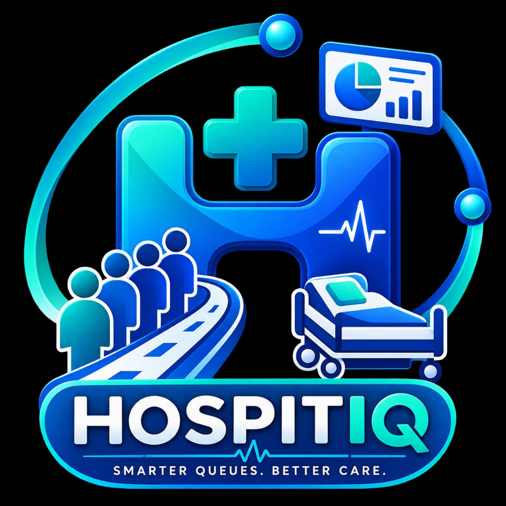

# 🏥 HOSPITIQ — Smart OPD Queue & Hospital Bed Management System

<p align="center">
  
</p>

<p align="center">
  <strong>SIH 2026 Innovation Project | Smart India Hackathon 2026</strong><br>
  <em>"Smarter Queues. Better Care." — Eliminating OPD Wait Times & Automating Hospital Operations Across India</em>
</p>

<p align="center">
  <a href="https://hospiti-q.vercel.app/"></a>
</p>

<p align="center">
  <a href="https://github.com/yesaswim06/HospitiQ"></a>
  <a href="https://nodejs.org/"></a>
  <a href="https://expressjs.com/"></a>
  <a href="https://mongodb.com/"></a>
  <a href="https://hospiti-q.vercel.app/"></a>
  <a href="LICENSE"></a>
</p>


## 🌐 Live Web Application & Demonstration
👉 **Official Live URL**: **[https://hospiti-q.vercel.app/](https://hospiti-q.vercel.app/)**

---

## 📌 Executive Summary & Problem Statement

In traditional healthcare systems across India, patients spend up to **3.5 hours** waiting in crowded Outpatient Department (OPD) queues, while hospital staff lack real-time visibility into bed occupancy, doctor consultation dispatching, and emergency admissions.

**HOSPITIQ (Med-Space)** resolves this healthcare crisis by implementing a real-time digital OPD token pass system, automated doctor room dispatching, smart bed matrix allocation, and contactless patient QR check-ins.

---

## 🌟 Key Features & Platform Highlights

### 🎟️ 1. Smart Contactless OPD Token Pass
- **Instant Token Generation**: Patients or receptionists generate sequential OPD token passes (`A-031`, `B-014`).
- **Live Wait Time Forecasting**: AI algorithms dynamically compute wait times based on historical doctor consultation speeds.
- **Contactless QR Pass**: Generates digital QR code passes printable or viewable on smartphones.

### 🩺 2. Doctor Consultation Terminal
- **Priority Triage Dispatch**: Categorizes patient queues by emergency level (*Emergency*, *High Priority*, *Standard*).
- **Vitals Monitoring Chips**: Displays real-time patient vitals (*Pulse*, *BP*, *Temp*).
- **1-Click Patient Calling**: Directs patients to assigned OPD consultation rooms (`OPD Room #104 — Cardiology`).

### 🛏️ 3. Hospital 100-Bed Matrix & Ward Layout
- **Real-Time Ward Monitoring**: Live tracking of ICU, Emergency, General, and Private wards.
- **Interactive Bed Map**: Visual grid status (*Occupied*, *Vacant*, *Under Cleaning*).
- **AI Bed Recommendation Engine**: Recommends optimal bed placement based on diagnosis and urgency.

### 👥 4. Role-Based Access Control (3 Distinct User Portals)
- **Patient Portal**: Live wait-time counter, digital QR code pass, SMS/WhatsApp alert status.
- **Doctor Portal**: Consultation terminal, room status toggles, patient calling, inline OPD registration.
- **Admin Command Center**: Executive capacity gauges, doctor CRUD administration, inpatient directory, analytics, and settings.

### 🚨 5. Emergency Siren & System Alerts
- **1-Click Hospital Siren**: Triggers hospital-wide emergency alert protocols across all connected terminals.
- **Theme-Reactive UI**: Supports sleek dark mode and high-contrast light mode.


## 📁 Repository & Project Architecture

```text
HospitiQ/
├── backend/                  # Express.js REST API Server & Database
│   ├── server.js             # REST API endpoints & route dispatchers
│   └── db.js                 # MongoDB Atlas integration & dataset fallback
├── frontend/                 # Client Web Application
│   └── public/
│       ├── index.html        # Single-page multi-view markup
│       ├── css/
│       │   └── styles.css    # Healthcare Glassmorphic Design System
│       ├── js/
│       │   ├── api.js        # REST API fetch client
│       │   └── app.js        # Dynamic UI state engine & router
│       └── images/           # Asset images & social icons
├── HOSPITIQ_Wall_QR_Poster.jpg # Printable Hospital Wall QR Poster Asset
├── README.md                 # Documentation
├── package.json              # Dependencies & startup scripts
├── server.js                 # Application launcher
└── vercel.json               # Vercel cloud deployment manifest
```

---

## 🛠️ Tech Stack & Technologies Used

- **Frontend**: HTML5, Vanilla JavaScript (ES6+), Vanilla CSS3 (Glassmorphism & CSS Variables), Lucide Vector Icons
- **Backend**: Node.js, Express.js REST Framework
- **Database**: MongoDB Atlas (with high-performance in-memory dataset fallback)
- **Live Deployment**: Vercel (`https://hospiti-q.vercel.app/`)

---

## 🚀 Quick Start & Local Setup Guide

### Prerequisites
- Node.js (`v16.0` or higher)
- npm or yarn

### 1. Clone the Repository
```bash
git clone https://github.com/yesaswim06/HospitiQ.git
cd HospitiQ
```

### 2. Install Dependencies
```bash
npm install
```

### 3. Start Development Server
```bash
npm start
```

### 4. Open in Browser
Open your browser and navigate to:  
👉 **`http://localhost:5000`** *(or http://localhost:5001)*


## 👥 SIH 2026 Innovation Team

| Name | Role |
| :--- | :--- |
| **M N YESASWI BHARGAV (TL)** | Team Lead |
| **RAMCHARAN G** | Frontend Developer |
| **MANJULA B** | UI/UX Designer |
| **MANVITHA N** | Graphic Designer |
| **SUPRIYA A** | Healthcare Researcher |
| **CHARAN TEJA M** | Technology Researcher |

---

## 📧 Support & Contact

- **Customer Care & Support**: `myselfadmin123@gmail.com`
- **Official Live Application**: [https://hospiti-q.vercel.app/](https://hospiti-q.vercel.app/)
- **Edition**: Smart India Hackathon 2026 (SIH 2026)
- **License**: MIT License
